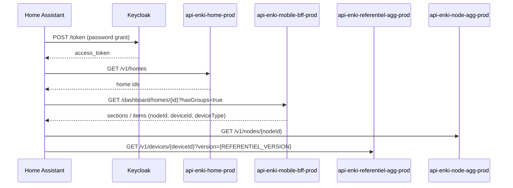

# Enki cloud API — engineering notes

This integration talks to the **unofficial** Enki REST API used by the Leroy Merlin / Adeo mobile app. There is no public developer portal for end users; behaviour was inferred from network traffic and [CyrilP/hass-enki-component](https://github.com/CyrilP/hass-enki-component).

## Authentication

| Item | Value |
|------|-------|
| OIDC token URL | `https://keycloak-prod.iot.leroymerlin.fr/realms/enki/protocol/openid-connect/token` |
| Grant | `password` (resource owner) |
| Client ID | `enki-front` |
| API gateway | `https://enki.api.devportal.adeo.cloud` |

Every microservice call sends:

- `Authorization: Bearer <access_token>`
- `X-Gateway-APIKey: <service-specific key>`
- `homeId: <uuid>` when the node belongs to a home

Gateway keys are bundled in `custom_components/enki/gateway_keys_data.py` (re-exported by `const.py`). They are **embedded in the Enki mobile APK** (one key per micro-service), not fetched from a central API. Refresh them after an app update with `scripts/extract_gateway_keys.py` (see [DEVELOPMENT.md](DEVELOPMENT.md)). A `401` means the credentials no longer work: Home Assistant opens its **reauthentication** flow. A `403` on the device poll usually means an outdated gateway key, and raises a **repair issue** with guidance.

A `403 {"message":"You cannot consume this service"}` is different: the gateway is refusing the key for a whole micro-service, for every account, and no key refresh fixes it — Adeo has to re-open the API product. The transport records the first one (so it still reaches diagnostics and read-error telemetry), then stops reading that service until Home Assistant restarts, instead of retrying on every polling cycle. `api-enki-consumption-prod` and `api-enki-ota-prod` have been in that state since August 2026 — the keys we ship are byte-for-byte the ones the current app uses. The luminosity service followed in September.

## Discovery flow



`REFERENTIEL_VERSION` is defined in [`const.py`](../custom_components/enki/const.py) and tracks the value the Enki app sends — a stale value returns a thinner capability set.

## Supported device types (this integration)

Detection is **capability-based** (referentiel metadata + BFF dashboard), not limited to a fixed list of model names.

| Referentiel / BFF type | HA platforms | Backend services |
|------------------------|--------------|------------------|
| `ceiling_fans` (+ fan capabilities) | `fan` + `light` | `api-enki-airflow-prod`, `api-enki-lighting-prod`, `api-enki-power-prod` |
| `lights` (+ light capabilities) | `light` | `api-enki-lighting-prod` |
| Switches / outlets (Edisio, …) | `light` (ON/OFF) | `api-enki-power-prod` (`switch-electrical-power`) |
| `inverters` (Envertech-Lexman solar) | `sensor` (power W) | BFF dashboard `description.value` |
| `access_and_motorizations` (Evology, Nodon, …) | `cover` (beta) | `api-enki-rolling-prod` — `shutter/{nodeId}/…` (key in `gateway_keys_data.py`) |
| `sensors` (motion, contact, temperature, …) | `binary_sensor`, `sensor`, `switch`, `number` | presence, contact, temperature-humidity, battery-health, siren micro-services |
| Heating / pilot wire / thermostat | `select`, `climate`, `switch`, `number`, `binary_sensor` | `api-enki-thermostat-prod` (setpoint, pilot wire, window/presence, offset, child-lock, preheating), `api-enki-presence-detector-prod` (occupancy); `ENKI_HEATING_API_KEY`/`ENKI_THERMOSTAT_API_KEY` in `gateway_keys_data.py`; if cleared, reads are skipped silently and writes raise an error |
| Water leak sensors | `binary_sensor`, `sensor` (battery) | `api-enki-water-leak-detector-prod` + `api-enki-battery-health-prod` — keys in `gateway_keys_data.py`; same fallback if a key is missing |
| `cameras` (Lexman / Meari) | `camera`, `sensor`, `binary_sensor` | `api-enki-lexman-camera-prod` (`/events?nodeId=…`) for events; config controls and live signaling on `api-enki-lexman-camera-meari-prod` — see [Lexman cameras](#lexman-cameras-api-enki-lexman-camera-meari-prod) for what each generation exposes |

Sensor capability paths: `GET/POST …/v1/sensors/{node_id}/{kebab-case-capability}` (siren uses `/v1/siren/`).

Multi-endpoint lights (several circuits on one node) create one HA light entity per BFF `mainChangeCapability` endpoint.

### Ceiling fan (Inspire Siroco+, ESDK)

State is split across services:

| Field | Endpoint | Notes |
|-------|----------|-------|
| `fan_speed` | `GET …/check-fan-speed` | `0` = off, `1–6` = speed levels |
| `airflow_mode` | `GET …/check-airflow-mode` | `MANUAL`, `BREEZE` |
| `airflow_rotation` | `GET …/check-fan-rotation-direction` | `CLOCKWISE` / `COUNTERCLOCKWISE` when supported |
| Light on/off (`light_power`) | `api-enki-lighting-prod` | `check-light-state` → `lastReportedValue.power` |
| Light `brightness`, `colorTemperature` | `api-enki-lighting-prod` | `change-light-state` (full `lastReportedValue` payload) |

Commands:

- `POST …/change-fan-speed` — body `{"value": <0-6>}`, expect `202`
- `POST …/change-airflow-mode` — body `{"value": "MANUAL"|"BREEZE"}`, expect `202` or `204` (mode brise)
- `POST …/change-fan-rotation-direction` — body `{"value": "CLOCKWISE"|"COUNTERCLOCKWISE"}`, expect `202` or `204` (Inspire; enables `fan.set_direction` in HA)
- `POST …/change-light-state` — full `lastReportedValue` object; `power` ON/OFF for the fan light kit
- `POST …/switch-electrical-power?endpoints=1|2` — fan motor only in practice; light kit uses lighting `power`

Fan motor and light kit are **independent** (turning the fan on does not switch the light on).

### Roller shutters (Evology SIN2RS1, …) — beta

**Base URL:** `https://enki.api.devportal.adeo.cloud/api-enki-rolling-prod/v1/shutter/{nodeId}/`

| Field | Endpoint | Notes |
|-------|----------|-------|
| `shutter_position` | `GET …/check-shutter-position` | `0–100` (% open) |
| `shutter_opening` | `GET …/check-shutter-opening` | `OPEN` / `CLOSED` |
| `roller_shutter_state` | `GET …/check-roller-shutter-state` | e.g. `OPENING` / `CLOSING` / `STOPPED` |
| `roller_shutter_mode` | `GET …/check-roller-shutter-mode` | `NORMAL` / `INVERTED` |

Commands:

- `POST …/change-shutter-position` — body `{"value": <0-100>}`, expect `202` or `204`
- `POST …/stop-change-shutter-position` — stop mid-travel (no body)
- `POST …/change-roller-shutter-mode` — body `{"value": "NORMAL"|"INVERTED"}`
- `POST …/execute-preset` — body `{"value": "<preset>"}` when referentiel lists presets
- `POST …/switch-roller-shutter` — body `{"value": "OPEN"|"CLOSED"}` for RTS motorizations

RTS models (Somfy, `tr_device_rts_roller_shutter_motorization_label`) expose only
`switch_roller_shutter` and `stop_change_shutter_position`: one-way radio, so no
position and no `check-*` feedback. The cover entity reports `assumed_state`.
Path segment unconfirmed against real hardware — see #96.

Gateway key: `ENKI_ACCESS_MOTORIZATION_API_KEY` in `gateway_keys_data.py`. Legacy path `api-enki-access-and-motorizations-prod` is obsolete. See [DEVELOPMENT.md](DEVELOPMENT.md#capturing-a-gateway-key-with-mitmproxy-fallback) for validating a key with mitmproxy.

### Dry-contact gate / garage receiver (Lexman 83424576, Nodon SIN-4-1-20)

**Referentiel capability:** `power_on_with_timer` only (Mpulse mode — timed impulse, no state read).

**HA entity:** `button` “Trigger”

| Command | Endpoint | Notes |
|---------|----------|-------|
| Impulse | `POST …/power-on-with-timer` | **No body** — `api-enki-power-prod` (APK `mbj.e`) |

Gateway key: `ENKI_POWER_API_KEY` (same as outlets). Distinct from roller shutters (`api-enki-rolling-prod`).

### Standard lights (Eglo V-Link, Lexman, etc.)

| Capability | Parameter | Wire format |
|------------|-----------|-------------|
| On/off | `power` | `"ON"` / `"OFF"` |
| Brightness | `brightness` | float, device-specific max (often `100`) |
| Colour temperature | `colorTemperature` | `"T3500K"` style strings |
| Hue (RGB bulbs) | `hue` | normalized float `0.0`–`1.0` (HA hue ÷ 360) |
| Saturation (RGB bulbs) | `saturation` | normalized float `0.0`–`1.0` (HA sat ÷ 100) |

RGB bulbs (e.g. Lexman) advertise `change_hue` + `change_saturation` and map to
HA's `ColorMode.HS`. When the bulb also advertises `change_color_temperature`,
the integration exposes both `hs` and `color_temp`; the reported `colorMode`
field (`hs` vs `ct`) indicates which mode is active.

## Heating and water sensors (manifest ≥ 1.5.0)

**Heating base URL:** `https://enki.api.devportal.adeo.cloud/api-enki-heating-prod/v1/heating/{nodeId}/`

| Capability | Platform | Notes |
|------------|----------|-------|
| `check_pilot_wire_state` / `switch_pilot_wire_mode` | `select` | COMFORT, ECO, OFF, … |
| `check_thermostat_target_temperature` / `change_thermostat_target_temperature` | `climate` | °C setpoint |
| `check_thermostat_running_state` | `climate` | HEAT / IDLE → `hvac_action` |
| `check_window_open_detection` | `binary_sensor` | WINDOW_OPEN / NO_WINDOW_OPEN |
| `check_occupancy` | `binary_sensor` | OCCUPIED / UNOCCUPIED |

**Water leak base URL:** `https://enki.api.devportal.adeo.cloud/api-enki-water-leak-detector-prod/v1/detectors/{nodeId}/`

| Capability | Platform |
|------------|----------|
| `check-water-sensor-state` | `binary_sensor` (moisture) |

Gateway keys (`ENKI_HEATING_API_KEY`, `ENKI_WATER_SENSOR_API_KEY`, …) are in `gateway_keys_data.py`. Refresh with `scripts/extract_gateway_keys.py` after an app update — see [DEVELOPMENT.md](DEVELOPMENT.md). If a key is cleared, reads are skipped silently and writes raise a clear error.

## Operational notifications

Home Assistant raises **repair issues** (Settings → Repairs, French or English) when:

| Situation | What you see |
|-----------|----------------|
| Invalid Enki credentials | Not a repair issue: Home Assistant's reauthentication flow asks for the password again |
| HTTP 403 (gateway key) | Hint to refresh keys from the APK |
| Network / cloud unreachable | Check Internet and `enki` logs |
| Enki cloud maintenance (`mobile-config`) | Shown while `maintenance: true`; cleared on the next poll when it ends |

Repair issues clear automatically after the next successful poll (maintenance is re-checked every poll; auth/gateway/connection clear after a successful device poll).

## Home alarm (api-enki-home-security-prod)

Base: `https://enki.api.devportal.adeo.cloud/api-enki-home-security-prod/v1/`
Gateway key: `ENKI_HOME_SECURITY_API_KEY`.

The alarm is **not a node**: the dashboard shows it as a tile with `template: "SECURITY"` and a
`metadata.securityId`, without any `deviceId` — so device discovery never sees it. Discovery
records that id per home, and only homes with such a tile are polled.

| Method | Path | Notes |
|--------|------|-------|
| GET | `security?homeId={homeId}` | `homeId`, `threatLevel`, `lastThreatDate`, `currentMode`, `alarmDelay` (s), `notificationsEnabled` |
| GET | `modes?homeId={homeId}` | `items[].type` — the modes configured in the app (a mode needs ≥ 1 detector and ≥ 1 siren) |
| PATCH | `security/{securityId}/homes/{homeId}/currentMode` | `{"currentMode": "FULL"}` — answers **200** with the new state, not 202 |
| PATCH | `security/{securityId}/homes/{homeId}/delay` / `…/notifications` | not wired |

Modes (`currentMode`, app enum) and their Home Assistant state:

| Enki | App label | Home Assistant |
|------|-----------|----------------|
| `DISABLED` | Disabled | `disarmed` |
| `FULL` | Total | `armed_away` |
| `PARTIAL` | Partial | `armed_home` |
| `PRESENCE` | Presence | `armed_night` |
| `INACTIVE` | — (never offered) | `disarmed` |

`threatLevel` values in the app: `DEFAULT`, `SAFE`, `ALERT`, `AUTO_PROTECTION`, `DANGER`,
`DETERRENCE`, `DETERRENCE_CONFIRMED`, `INTRUSION`, `INTRUSION_CONFIRMED`. The entity reports
**triggered** only for `INTRUSION`, `INTRUSION_CONFIRMED` and `DANGER`; the raw value stays in the
`threat_level` attribute. That split is a first pass — none of this has run against a real
installation yet.

## Scenarios (api-enki-scenario-prod)

Base: `https://enki.api.devportal.adeo.cloud/api-enki-scenario-prod/v1/scenarios`

| Method | Path | Notes |
|--------|------|-------|
| GET | `/scenarios?homeId={homeId}` | List (`items[]` with `id`, `label`, `enabled`, `status`) |
| POST | `/scenarios/{scenarioId}/activate` | Run scenario (`homeId` header) |

Gateway key: `ENKI_SCENARIO_API_KEY` in `gateway_keys_data.py`.

## Instant consumption (api-enki-consumption-prod)

Base: `https://enki.api.devportal.adeo.cloud/api-enki-consumption-prod/v1/consumption`

| Method | Path | Notes |
|--------|------|-------|
| GET | `/{nodeId}/check-instant-consumption?homeId={homeId}` | `lastReportedValue` (W), `unit` |

Used for Edisio / Equation devices with `check_electrical_consumption` in referentiel. Gateway key: `ENKI_CONSUMPTION_API_KEY`. **Refused to every account since August 2026** (`403 You cannot consume this service`) — see [Authentication](#authentication).

## Lexman cameras (api-enki-lexman-camera-meari-prod)

Base: `https://enki.api.devportal.adeo.cloud/api-enki-lexman-camera-meari-prod/v1/`
Gateway key: `ENKI_LEXMAN_CAMERA_MEARI_API_KEY`. Headers: `Authorization`, `X-Gateway-APIKey`, `homeId`.

Two camera generations coexist:

| Generation | Backing service | Live video |
|------------|-----------------|------------|
| meari (solar / outdoor, 2K…) | `api-enki-lexman-camera-meari-prod` | WebRTC over the meari signaling WebSocket (documented below) |
| earlier Lexman cameras | `api-enki-lexman-camera-prod` | TUTK Kalay P2P — node payload carries `p2pId` / `p2pAuthKey` / `p2pPassword`, and the app drives them through the native `com.tutk.IOTC` SDK |

Only the meari generation is reachable without a native SDK. A camera that is not in the
meari backend answers `404 NOT_FOUND` on **every** meari route — including all `change-*`
writes — while an unknown enum value answers `400 BAD_REQUEST` first (values are validated
before the device lookup). `check-camera-status` is therefore the cheapest way to tell a
"wrong value" from a "wrong service". A `403` would mean something else entirely: the gateway
refusing the key for the service, as it does for `consumption` and `ota`.

Measured on a Lexman IPC176KF (`tr_device_lexman_camera_outdoor_label`), the pre-meari
generation ([#165](https://github.com/cyrilcolinet/enki-integration-hass/issues/165)):

- every meari route answers `404`, under any identifier the node carries (`nodeId`,
  `deviceId`, `externalId`, `eui64`, `p2pId`, MAC);
- a network capture of the app opening the live view shows **no HTTP call at all** for video
  or settings — 12 packets to `enki.api.devportal.adeo.cloud` (the login), then a rendezvous
  with `*.iotcplatform.com` (ThroughTek) and ~6 MB of UDP straight from the camera on the LAN;
- the camera opens **no local port** (RTSP, ONVIF, HTTP) — nothing to fall back on.

So on that generation both live video and settings are out of reach, and it is not a matter of
finding the right endpoint: there is none. The meari generation, whose devices carry the
`tr_device_lexman_camera_meari_solar_label` referentiel key, is the one the sections below
describe. The REST reads are **confirmed on a real solar camera** ([#216](https://github.com/cyrilcolinet/enki-integration-hass/issues/216)); the writes and the live-view
signaling are reconstructed from the app and not exercised yet — `scripts/probe_camera_stream.py`
is what will confirm them.

### REST

| Method | Path | Notes |
|--------|------|-------|
| GET | `camera/{nodeId}/check-camera-status` | battery, wifi, sd card, firmware and every current setting — shape below |
| GET | `camera/{nodeId}/check-camera-events?day=…` | event list (thumbnails) |
| GET | `camera/{nodeId}/check-camera-connect-wss` | signaling credentials (see below) |
| GET | `camera/{nodeId}/check-detection-zone` / `check-firmware-update-status` | |
| POST | `camera/{nodeId}/wake-up` | wakes a dormant (battery) camera |
| POST | `camera/{nodeId}/change-night-vision-mode` | `{"value": "SMART" \| "FULL_COLOR" \| "BLACK_AND_WHITE"}` |
| POST | `camera/{nodeId}/change-motion-detection-mode` | `{"value": "ON" \| "OFF" \| "HUMAN_FORM"}` |
| POST | `camera/{nodeId}/change-indicator-light-mode` | `{"value": "ON" \| "OFF"}` |
| POST | `camera/{nodeId}/change-flip-screen-mode` | `{"value": "FLIP" \| "NOT_FLIP"}` |
| POST | `camera/{nodeId}/change-motion-detection-sensitivity-level` | `{"value": <int>}` |
| POST | `camera/{nodeId}/change-humanoid-detection-sensitivity-level` | `{"value": <int>}` |
| POST | `camera/{nodeId}/change-recording-duration` | `{"value": "TEN_SECONDS" \| "TWENTY_SECONDS" \| "THIRTY_SECONDS" \| "FORTY_SECONDS" \| "ONE_MINUTE" \| "TWO_MINUTES" \| "THREE_MINUTES" \| "AUTO"}` |
| POST | `camera/{nodeId}/change-light-mode`, `change-detection-zone` | not exposed: light mode reads `"ON"` on a solar camera, other values not pinned down yet |
| POST | `camera/{nodeId}/format-sd-card`, `update-firmware-version` | destructive — not exposed |

The `change-*` routes return the updated setting in the body (APK return types), so the integration accepts **200** as well as 202/204 for them. `check-camera-status` is polled at most every 5 minutes per camera, and the cache is dropped after each write.

`check-camera-status`, as returned by a Lexman solar camera (first real meari response, [#216](https://github.com/cyrilcolinet/enki-integration-hass/issues/216)):

```json
{
  "batteryLevel": "100", "wifiStrength": "52", "batteryChargingStatus": "CHARGING_FULL",
  "motionDetection": "HUMAN_FORM", "motionDetectionSensitivityLevel": 6,
  "humanFormDetectionSensitivityLevel": 3, "indicatorLight": "ON", "flipScreenMode": "NOT_FLIP",
  "lightMode": "ON", "nightVisionMode": "SMART", "recordingDuration": "TEN_SECONDS",
  "firmware": {"otaEnabled": true, "otaVersion": "…", "newOtaAvailable": false, "otaUpgradeMandatory": false},
  "sdCard": {"state": "NO_CARD_INSERTED", "total": 0, "free": 0}
}
```

`batteryChargingStatus` is `NOT_CHARGING` / `CHARGING` / `CHARGING_FULL`; `sdCard.state` is one of
`NO_CARD_INSERTED`, `NORMAL_USE`, `ABNORMAL_CARD_READ_WRITE`, `FORMATTING`, `FILE_SYSTEM_NOT_SUPPORTED`,
`CARD_BEING_RECOGNIZED`, `NOT_FORMATTED`, `OTHER_ERRORS`.

### Live video — meari WebRTC signaling

`check-camera-connect-wss` returns `wssUrl`, `accessId`, `signature`, `token`,
`expires`, `callee`, `deviceCode`. Open that WebSocket (no extra header) and exchange JSON
frames; every frame shares the same envelope:

```json
{"sid": "<uuid uppercase>", "method": "<option|offer|answer|candidate|settings>",
 "action": "req", "cmd": "mts", "params": { }}
```

`caller` is a client id (16 hex chars), `callee` and `devicecode` come from the REST call.

1. **Authenticate** — `method: "option"`, with `"auth": {accessId, signature, token}` and
   `params: {caller, callee, devicecode, expires, continent: "Europe", country: "France"}`.
   The reply (`method: "option"`) carries the relay: `coturn_host`, `coturn_ip`,
   `coturn_port`, `username`, `pwd`.
2. **Offer** — `method: "offer"`, `params: {caller, callee, devicecode, sdp,
   settings: {method: "preview"}}`. The app offers audio `sendrecv` (two-way talk) plus
   video `recvonly`, ICE **relay-only** through that coturn server.
3. **Answer** — inbound `method: "answer"`, `params.sdp`.
4. **ICE** — `method: "candidate"` both ways, `params: {caller, callee,
   candidate: {candidate, sdpMid, sdpMLineIndex}}`.
5. **Start the stream** — `method: "settings"`, `params: {caller, callee,
   settings: {sid, method: "preview", streams: [{channel: 0, stream: 1, stop: 0}]}}`.
   Recorded playback uses the same shape with `method: "playback"`.

Errors arrive as `{sid, method, action, cmd, errid, errstr}` (plus `desc` when the camera is
asleep). `errstr` values `device dormancy`, `device awaken timeout`, `device offline` and
`session not found` mean "wake the camera and retry", not "wrong request".

The `camera` entity of a meari camera runs this sequence for Home Assistant's frontend (`api/meari_signaling.py`): the browser's offer and ICE candidates are relayed as `offer` / `candidate` frames, the camera's `answer` and candidates are sent back to the browser, and `settings` / `preview` starts the stream once the answer is in (`stop: 1` on close). Errors are fatal only until the answer. The TURN relay from the `option` reply is **not** given to the browser: it only arrives after authentication, and Home Assistant configures the browser before its offer.

`scripts/probe_camera_stream.py` replays the whole sequence and prints, per camera, whether
it is a meari device, whether signaling authenticates and whether the camera answers an SDP
offer.

## Future device families

The Enki app also controls alarms via other microservices. Use `scripts/discover_devices.py` to dump unknown `deviceType` values from your account before adding new platforms.

## References

- [CyrilP/hass-enki-component](https://github.com/CyrilP/hass-enki-component) (lights)
- Product docs: [Enki support — Inspire](https://support.enki-home.com/)
