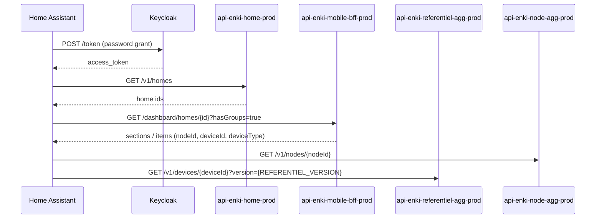

# Enki cloud API — engineering notes

This integration talks to the **unofficial** Enki REST API used by the Leroy Merlin / Adeo mobile app. There is no public developer portal for end users; behaviour was inferred from network traffic and [CyrilP/hass-enki-component](https://github.com/CyrilP/hass-enki-component).

## Authentication

| Item | Value |
|------|-------|
| OIDC token URL | `https://keycloak-prod.iot.leroymerlin.fr/realms/enki/protocol/openid-connect/token` |
| Grant | `password` (resource owner) |
| Client ID | `enki-front` |
| API gateway | `https://enki.api.devportal.adeo.cloud` |

Every microservice call sends:

- `Authorization: Bearer <access_token>`
- `X-Gateway-APIKey: <service-specific key>`
- `homeId: <uuid>` when the node belongs to a home

Gateway keys are bundled in `custom_components/enki/gateway_keys_data.py` (re-exported by `const.py`). They are **embedded in the Enki mobile APK** (one key per micro-service), not fetched from a central API. Refresh them after an app update with `scripts/extract_gateway_keys.py` (see [DEVELOPMENT.md](DEVELOPMENT.md)). Each wired key is followed from its literal in the APK to the retrofit interface bound to that micro-service, and that chain is recorded in `scripts/gateway_key_evidence.json`, which CI enforces — a key the extractor cannot prove is refused rather than shipped ([#275](https://github.com/cyrilcolinet/enki-integration-hass/issues/275)). A `401` means the credentials no longer work: Home Assistant opens its **reauthentication** flow. A `403` on the device poll usually means an outdated gateway key, and raises a **repair issue** with guidance.

A `403 {"message":"You cannot consume this service"}` is different: the gateway is refusing the key for a whole micro-service rather than the account. The transport records the first one (so it still reaches diagnostics and read-error telemetry), then stops reading that service until Home Assistant restarts, instead of retrying on every polling cycle.

**Always check the key against the app before blaming the gateway.** Every such 403 traced so far turned out to be our own key: the extractor had picked a neighbouring micro-service's key for `api-enki-luminosity-sensor-prod` ([#256](https://github.com/cyrilcolinet/enki-integration-hass/issues/256)), `api-enki-consumption-prod` ([#270](https://github.com/cyrilcolinet/enki-integration-hass/issues/270)), `api-enki-ota-prod` ([#268](https://github.com/cyrilcolinet/enki-integration-hass/issues/268)) and `api-enki-esdk-prod`. Grep the APK for the key the app passes to that service's retrofit interface — no service has been proven closed on Adeo's side.

## Discovery flow


```mermaid
sequenceDiagram
    participant HA as Home Assistant
    participant Auth as Keycloak
    participant Home as api-enki-home-prod
    participant BFF as api-enki-mobile-bff-prod
    participant Ref as api-enki-referentiel-agg-prod
    participant Node as api-enki-node-agg-prod

    HA->>Auth: POST /token (password grant)
    Auth-->>HA: access_token
    HA->>Home: GET /v1/homes
    Home-->>HA: home ids
    HA->>BFF: GET /dashboard/homes/{id}?hasGroups=true
    BFF-->>HA: sections / items (nodeId, deviceId, deviceType)
    HA->>Node: GET /v1/nodes/{nodeId}
    HA->>Ref: GET /v1/devices/{deviceId}?version={REFERENTIEL_VERSION}
```

`REFERENTIEL_VERSION` is defined in [`const.py`](../custom_components/enki/const.py) and tracks the value the Enki app sends — a stale value returns a thinner capability set.

## Supported device types (this integration)

Detection is **capability-based** (referentiel metadata + BFF dashboard), not limited to a fixed list of model names.

| Referentiel / BFF type | HA platforms | Backend services |
|------------------------|--------------|------------------|
| `ceiling_fans` (+ fan capabilities) | `fan` + `light` | `api-enki-airflow-prod`, `api-enki-lighting-prod`, `api-enki-power-prod` |
| `lights` (+ light capabilities) | `light` | `api-enki-lighting-prod` |
| Switches / outlets (Edisio, …) | `light` (ON/OFF) | `api-enki-power-prod` (`switch-electrical-power`) |
| `inverters` (Envertech-Lexman solar) | `sensor` (power W) | BFF dashboard `description.value` |
| `access_and_motorizations` (Evology, Nodon, …) | `cover` (beta) | `api-enki-rolling-prod` — `shutter/{nodeId}/…` (key in `gateway_keys_data.py`) |
| `sensors` (motion, contact, temperature, …) | `binary_sensor`, `sensor`, `switch`, `number` | presence, contact, temperature-humidity, battery-health, siren micro-services |
| Heating / pilot wire / thermostat | `select`, `climate`, `switch`, `number`, `binary_sensor` | `api-enki-thermostat-prod` (setpoint, pilot wire, window/presence, offset, child-lock, preheating), `api-enki-presence-detector-prod` (occupancy); `ENKI_HEATING_API_KEY`/`ENKI_THERMOSTAT_API_KEY` in `gateway_keys_data.py`; if cleared, reads are skipped silently and writes raise an error |
| Water leak sensors | `binary_sensor`, `sensor` (battery) | `api-enki-water-leak-detector-prod` + `api-enki-battery-health-prod` — keys in `gateway_keys_data.py`; same fallback if a key is missing |
| `cameras` (Lexman / Meari) | `camera`, `sensor`, `binary_sensor` | `api-enki-lexman-camera-prod` (`/events?nodeId=…`) for events; config controls and live signaling on `api-enki-lexman-camera-meari-prod` — see [Lexman cameras](#lexman-cameras-api-enki-lexman-camera-meari-prod) for what each generation exposes |

Sensor capability paths: `GET/POST …/v1/sensors/{node_id}/{kebab-case-capability}` (siren uses `/v1/siren/`).

Multi-endpoint lights (several circuits on one node) create one HA light entity per BFF `mainChangeCapability` endpoint.

### Ceiling fan (Inspire Siroco+, ESDK)

State is split across services:

| Field | Endpoint | Notes |
|-------|----------|-------|
| `fan_speed` | `GET …/check-fan-speed` | `0` = off, `1–6` = speed levels |
| `airflow_mode` | `GET …/check-airflow-mode` | `MANUAL`, `BREEZE` |
| `airflow_rotation` | `GET …/check-fan-rotation-direction` | `CLOCKWISE` / `COUNTERCLOCKWISE` when supported |
| Light on/off (`light_power`) | `api-enki-lighting-prod` | `check-light-state` → `lastReportedValue.power` |
| Light `brightness`, `colorTemperature` | `api-enki-lighting-prod` | `change-light-state` (full `lastReportedValue` payload) |

Commands:

- `POST …/change-fan-speed` — body `{"value": <0-6>}`, expect `202`
- `POST …/change-airflow-mode` — body `{"value": "MANUAL"|"BREEZE"}`, expect `202` or `204` (mode brise)
- `POST …/change-fan-rotation-direction` — body `{"value": "CLOCKWISE"|"COUNTERCLOCKWISE"}`, expect `202` or `204` (Inspire; enables `fan.set_direction` in HA)
- `POST …/change-light-state` — full `lastReportedValue` object; `power` ON/OFF for the fan light kit
- `POST …/switch-electrical-power?endpoints=1|2` — fan motor only in practice; light kit uses lighting `power`

Fan motor and light kit are **independent** (turning the fan on does not switch the light on).

### Roller shutters (Evology SIN2RS1, …) — beta

**Base URL:** `https://enki.api.devportal.adeo.cloud/api-enki-rolling-prod/v1/shutter/{nodeId}/`

| Field | Endpoint | Notes |
|-------|----------|-------|
| `shutter_position` | `GET …/check-shutter-position` | `0–100` (% open) |
| `shutter_opening` | `GET …/check-shutter-opening` | `OPEN` / `CLOSED` |
| `roller_shutter_state` | `GET …/check-roller-shutter-state` | e.g. `OPENING` / `CLOSING` / `STOPPED` |
| `roller_shutter_mode` | `GET …/check-roller-shutter-mode` | `NORMAL` / `INVERTED` |

Commands:

- `POST …/change-shutter-position` — body `{"value": <0-100>}`, expect `202` or `204`
- `POST …/stop-change-shutter-position` — stop mid-travel (no body)
- `POST …/change-roller-shutter-mode` — body `{"value": "NORMAL"|"INVERTED"}`
- `POST …/execute-preset` — body `{"value": "<preset>"}` when referentiel lists presets
- `POST …/switch-roller-shutter` — body `{"value": "OPEN"|"CLOSED"}` for RTS motorizations

RTS models (Somfy, `tr_device_rts_roller_shutter_motorization_label`) expose only
`switch_roller_shutter` and `stop_change_shutter_position`: one-way radio, so no
position and no `check-*` feedback. The cover entity reports `assumed_state`.
Path segment unconfirmed against real hardware — see #96.

Gateway key: `ENKI_ACCESS_MOTORIZATION_API_KEY` in `gateway_keys_data.py`. Legacy path `api-enki-access-and-motorizations-prod` is obsolete. See [DEVELOPMENT.md](DEVELOPMENT.md#capturing-a-gateway-key-with-mitmproxy-fallback) for validating a key with mitmproxy.

### Dry-contact gate / garage receiver (Lexman 83424576, Nodon SIN-4-1-20)

**Referentiel capability:** `power_on_with_timer` only (Mpulse mode — timed impulse, no state read).

**HA entity:** `button` “Trigger”

| Command | Endpoint | Notes |
|---------|----------|-------|
| Impulse | `POST …/power-on-with-timer` | **No body** — `api-enki-power-prod` (APK `mbj.e`) |

Gateway key: `ENKI_POWER_API_KEY` (same as outlets). Distinct from roller shutters (`api-enki-rolling-prod`).

### Standard lights (Eglo V-Link, Lexman, etc.)

| Capability | Parameter | Wire format |
|------------|-----------|-------------|
| On/off | `power` | `"ON"` / `"OFF"` |
| Brightness | `brightness` | float, device-specific max (often `100`) |
| Colour temperature | `colorTemperature` | `"T3500K"` style strings |
| Hue (RGB bulbs) | `hue` | normalized float `0.0`–`1.0` (HA hue ÷ 360) |
| Saturation (RGB bulbs) | `saturation` | normalized float `0.0`–`1.0` (HA sat ÷ 100) |

RGB bulbs (e.g. Lexman) advertise `change_hue` + `change_saturation` and map to
HA's `ColorMode.HS`. When the bulb also advertises `change_color_temperature`,
the integration exposes both `hs` and `color_temp`; the reported `colorMode`
field (`hs` vs `ct`) indicates which mode is active.

## Heating and water sensors (manifest ≥ 1.5.0)

**Heating base URL:** `https://enki.api.devportal.adeo.cloud/api-enki-heating-prod/v1/heating/{nodeId}/`

| Capability | Platform | Notes |
|------------|----------|-------|
| `check_pilot_wire_state` / `switch_pilot_wire_mode` | `select` | COMFORT, ECO, OFF, … |
| `check_thermostat_target_temperature` / `change_thermostat_target_temperature` | `climate` | °C setpoint |
| `check_thermostat_running_state` | `climate` | HEAT / IDLE → `hvac_action` |
| `check_window_open_detection` | `binary_sensor` | WINDOW_OPEN / NO_WINDOW_OPEN |
| `check_occupancy` | `binary_sensor` | OCCUPIED / UNOCCUPIED |

**Water leak base URL:** `https://enki.api.devportal.adeo.cloud/api-enki-water-leak-detector-prod/v1/detectors/{nodeId}/`

| Capability | Platform |
|------------|----------|
| `check-water-sensor-state` | `binary_sensor` (moisture) |

Gateway keys (`ENKI_HEATING_API_KEY`, `ENKI_WATER_SENSOR_API_KEY`, …) are in `gateway_keys_data.py`. Refresh with `scripts/extract_gateway_keys.py` after an app update — see [DEVELOPMENT.md](DEVELOPMENT.md). If a key is cleared, reads are skipped silently and writes raise a clear error.

## Command responses

A write is accepted on **202**, **204** or **201**: the water-heater setpoint creates a
derogation and answers 201 with the created object ([#269](https://github.com/cyrilcolinet/enki-integration-hass/issues/269)). **200** stays out — it is what a read
answers — except on the few routes that reply with the updated state, which pass their own
list (alarm mode, meari `change-*`).

## Operational notifications

Home Assistant raises **repair issues** (Settings → Repairs, French or English) when:

| Situation | What you see |
|-----------|----------------|
| Invalid Enki credentials | Not a repair issue: Home Assistant's reauthentication flow asks for the password again |
| HTTP 403 (gateway key) | Hint to refresh keys from the APK |
| Network / cloud unreachable | Check Internet and `enki` logs |
| Enki cloud maintenance (`mobile-config`) | Shown while `maintenance: true`; cleared on the next poll when it ends |

Repair issues clear automatically after the next successful poll (maintenance is re-checked every poll; auth/gateway/connection clear after a successful device poll).

## Home alarm (api-enki-home-security-prod)

Base: `https://enki.api.devportal.adeo.cloud/api-enki-home-security-prod/v1/`
Gateway key: `ENKI_HOME_SECURITY_API_KEY`.

The alarm is **not a node**: the dashboard shows it as a tile with `template: "SECURITY"` and a
`metadata.securityId`, without any `deviceId` — so device discovery never sees it. Discovery
records that id per home, and only homes with such a tile are polled.

| Method | Path | Notes |
|--------|------|-------|
| GET | `security?homeId={homeId}` | `homeId`, `threatLevel`, `lastThreatDate`, `currentMode`, `alarmDelay` (s), `notificationsEnabled` |
| GET | `modes?homeId={homeId}` | `items[].type` — the modes configured in the app (a mode needs ≥ 1 detector and ≥ 1 siren) |
| PATCH | `security/{securityId}/homes/{homeId}/currentMode` | `{"currentMode": "FULL"}` — answers **200** with the new state, not 202 |
| PATCH | `security/{securityId}/homes/{homeId}/delay` / `…/notifications` | not wired |

Modes (`currentMode`, app enum) and their Home Assistant state:

| Enki | App label | Home Assistant |
|------|-----------|----------------|
| `DISABLED` | Disabled | `disarmed` |
| `FULL` | Total | `armed_away` |
| `PARTIAL` | Partial | `armed_home` |
| `PRESENCE` | Presence | `armed_night` |
| `INACTIVE` | — (never offered) | `disarmed` |

`threatLevel` values in the app: `DEFAULT`, `SAFE`, `ALERT`, `AUTO_PROTECTION`, `DANGER`,
`DETERRENCE`, `DETERRENCE_CONFIRMED`, `INTRUSION`, `INTRUSION_CONFIRMED`. The entity reports
**triggered** only for `INTRUSION`, `INTRUSION_CONFIRMED` and `DANGER`; the raw value stays in the
`threat_level` attribute. That split is a first pass — none of this has run against a real
installation yet.

## Scenarios (api-enki-scenario-prod)

Base: `https://enki.api.devportal.adeo.cloud/api-enki-scenario-prod/v1/scenarios`

| Method | Path | Notes |
|--------|------|-------|
| GET | `/scenarios?homeId={homeId}` | List (`items[]` with `id`, `label`, `enabled`, `status`) |
| POST | `/scenarios/{scenarioId}/activate` | Run scenario (`homeId` header) |

Gateway key: `ENKI_SCENARIO_API_KEY` in `gateway_keys_data.py`.

## Equation air conditioner (api-enki-equation-airco-prod)

Base: `https://enki.api.devportal.adeo.cloud/api-enki-equation-airco-prod/v1/equation-airco`
Gateway key: `ENKI_EQUATION_AIRCO_API_KEY`. Headers: `Authorization`, `X-Gateway-APIKey`, `homeId`.

| Method | Path | Notes |
|--------|------|-------|
| GET | `{nodeId}/check-airconditioner-state` | `lastReportedValue` is an **object**, not a scalar |
| GET | `{nodeId}/check-airconditioner-error` | not read yet |
| POST | `{nodeId}/change-airconditioner-state` | not called — see below |

```json
{"lastReportedValue": {
  "targetTemperature": 21.0, "currentTemperature": 26.0, "operatingMode": "…", "power": "ON",
  "fanSpeed": "…", "swingOrientation": "…", "selfCleanMode": "OFF", "frostProtectionMode": "OFF",
  "healthMode": "OFF", "quietMode": "OFF", "sleepMode": "OFF"}}
```

The write body mirrors those fields exactly, so the device describes a `climate` entity rather than the ON/OFF
switch currently exposed. **What the APK does not say is which values `operatingMode`, `fanSpeed` and
`swingOrientation` accept** — the referentiel publishes none of them. The read is wired and flattened into the
diagnostics export so a reporter's own unit can answer that; nothing is written until it has
([#286](https://github.com/cyrilcolinet/enki-integration-hass/issues/286)).

## Equation water heater (api-enki-equation-water-heater-prod)

Base: `https://enki.api.devportal.adeo.cloud/api-enki-equation-water-heater-prod/v1/equation-water-heater`
Gateway key: `ENKI_EQUATION_WATER_HEATER_API_KEY`. Headers: `Authorization`, `X-Gateway-APIKey`, `homeId`.

| Method | Path | Notes |
|--------|------|-------|
| GET | `{nodeId}/check-water-heater-mode` | `lastReportedValue` is the mode |
| GET | `{nodeId}/check-water-heater-error` | not read yet |

The mode is one of the values the heater declares for `check_water_heater_mode` in the referentiel —
`AUTO`, `MANUAL`, `BOOST`, `BOOST_PLUS`, `PROG`, `CLEAN` on an AD-HEWH3-1. Self-clean is `CLEAN` on the wire, not
`SELF_CLEAN`, and there is no `ECO`.

**The write is not on this service.** An earlier app version served
`POST {nodeId}/change-water-heater-mode` with `{"mode": "SELF_CLEAN"}`, and it is gone in 2.26.3. A capture of app
2.27.0 found where it went: heating-controller's generic policy route, below.

## Heating controller (api-enki-heating-controller-prod)

Base: `https://enki.api.devportal.adeo.cloud/api-enki-heating-controller-prod/v1`
Gateway key: `ENKI_HEATING_CONTROLLER_API_KEY`. Headers: `Authorization`, `X-Gateway-APIKey`, `homeId`.

| Method | Path | Notes |
|--------|------|-------|
| POST | `nodes/{nodeId}/policies` | `{"capabilityId": "change_water_heater_mode", "value": "CLEAN"}` → `204`, empty body |
| GET | `override-commands/infos?capabilityIds=…&homeId=…&nodeId=…` | the app reads it before opening the mode sheet; not used |

Every mode the app's sheet offers goes through the same route, only `value` changing (captured from app 2.27.0
on an AD-HEWH3-1, [#285](https://github.com/cyrilcolinet/enki-integration-hass/issues/285)).

What the heater does with it, seen on that unit:

- A mode carries its own setpoint. CLEAN drove the target to 80 °C, above the 75 °C the `climate` entity
  allows, and a setpoint written during CLEAN was overridden.
- MANUAL comes back with the setpoint it last held, not the last one written — 55 °C here, after the
  integration had set 40 °C.
- Writing a setpoint does not change the mode.
- `check-water-heater-mode` followed a write 1.5 to 4 minutes later.

## Consumption (api-enki-consumption-prod)

Base: `https://enki.api.devportal.adeo.cloud/api-enki-consumption-prod/v1/consumption`

| Method | Path | Notes |
|--------|------|-------|
| GET | `/{nodeId}/check-instant-consumption?homeId={homeId}` | `lastReportedValue` (W), `unit`, `lastReportedDate` |
| GET | `/nodes/{nodeId}?startDate=&timePeriod=` | Energy over one period, in buckets (`homeId` **header**) |

`lastReportedDate` is exposed as a `last_reported_at` attribute. It is not the time of the last poll: on the
units measured so far it moves only when the value itself changes, so an old date on an idle device means
nothing has changed, not that the reading is stale.

The app sends `POST energy/{nodeId}/switch-instant-power-report` with `{"value": 30}`
(`InstantPowerReportRequestApiModel`) once, as its consumption screen opens, right before reading. The
integration does not call it, and measurement says it does not need to: on an Equation water heater with
nothing calling it, the reading tracked the element cycling on and off in the same poll as `hvac_action`, and
caught a three-minute off-cycle that `hvac_action` missed. What `30` means is unknown from one sample — a 30 s
interval and a 30 min duration both fit — and in this service `switch-…` writes a setting, its sibling
`switch-energy-mode` pairing with `check-energy-mode`, so calling it blind would reconfigure the device
([#279](https://github.com/cyrilcolinet/enki-integration-hass/issues/279)).

Used for Edisio / Equation devices with `check_electrical_consumption` in referentiel. Gateway key: `ENKI_CONSUMPTION_API_KEY` — the shipped key was a neighbouring service's until [#270](https://github.com/cyrilcolinet/enki-integration-hass/issues/270).

### Energy history

`startDate` is an instant (ISO-8601 with `Z`) that **picks a period, not a range**: the response snaps to the
period enclosing it. `timePeriod` decides the buckets — `DAILY` gives 24 hours, `WEEKLY` 7 days, `MONTHLY` the
days of that month, `YEARLY` 12 months. Note that `homeId` travels as a header here, while
`check-instant-consumption` takes it as a query parameter.

```json
{"firstMeasurementDate": "…", "lastMeasurementDate": "…",
 "periodConsumption": {"value": 25.255, "unit": "kWh", "date": "…"},
 "periodChart": {"series": [{"data": [null, 0.0, 1.805, …],
                             "startDateFormatted": "01/09/2026",
                             "endDateFormatted": "30/09/2026", "unit": "kWh"}],
                 "type": "BAR", "yScale": {"minimum": 0.0, "maximum": 3.7}}}
```

`null` is "no reading", **not** zero: future buckets and anything before `firstMeasurementDate` are null, while a
real zero is `0.0`. `periodConsumption.value` is the sum of the buckets, not an independent figure. Finished
periods are stable — re-reading September returns the same total — so a backfill would be safe. The integration
reads the current month once an hour and exposes the sum as a `total_increasing` energy sensor; it does not
import history into long-term statistics ([#270](https://github.com/cyrilcolinet/enki-integration-hass/issues/270)).

## Lexman cameras (api-enki-lexman-camera-meari-prod)

Base: `https://enki.api.devportal.adeo.cloud/api-enki-lexman-camera-meari-prod/v1/`
Gateway key: `ENKI_LEXMAN_CAMERA_MEARI_API_KEY`. Headers: `Authorization`, `X-Gateway-APIKey`, `homeId`.

Two camera generations coexist:

| Generation | Backing service | Live video |
|------------|-----------------|------------|
| meari (solar / outdoor, 2K…) | `api-enki-lexman-camera-meari-prod` | WebRTC over the meari signaling WebSocket (documented below) |
| earlier Lexman cameras | `api-enki-lexman-camera-prod` | TUTK Kalay P2P — node payload carries `p2pId` / `p2pAuthKey` / `p2pPassword`, and the app drives them through the native `com.tutk.IOTC` SDK |

Only the meari generation is reachable without a native SDK. A camera that is not in the
meari backend answers `404 NOT_FOUND` on **every** meari route — including all `change-*`
writes — while an unknown enum value answers `400 BAD_REQUEST` first (values are validated
before the device lookup). `check-camera-status` is therefore the cheapest way to tell a
"wrong value" from a "wrong service". A `403` would mean something else entirely: the gateway
refusing the key for the service, as it does for `consumption` and `ota`.

Measured on a Lexman IPC176KF (`tr_device_lexman_camera_outdoor_label`), the pre-meari
generation ([#165](https://github.com/cyrilcolinet/enki-integration-hass/issues/165)):

- every meari route answers `404`, under any identifier the node carries (`nodeId`,
  `deviceId`, `externalId`, `eui64`, `p2pId`, MAC);
- a network capture of the app opening the live view shows **no HTTP call at all** for video
  or settings — 12 packets to `enki.api.devportal.adeo.cloud` (the login), then a rendezvous
  with `*.iotcplatform.com` (ThroughTek) and ~6 MB of UDP straight from the camera on the LAN;
- the camera opens **no local port** (RTSP, ONVIF, HTTP) — nothing to fall back on.

So on that generation both live video and settings are out of reach, and it is not a matter of
finding the right endpoint: there is none. The meari generation, whose devices carry the
`tr_device_lexman_camera_meari_solar_label` referentiel key, is the one the sections below
describe. Reads, writes and the live view are all **confirmed on a real solar camera**
([#216](https://github.com/cyrilcolinet/enki-integration-hass/issues/216)); `scripts/probe_camera_stream.py` replays the signaling without Home Assistant.

### REST

| Method | Path | Notes |
|--------|------|-------|
| GET | `camera/{nodeId}/check-camera-status` | battery, wifi, sd card, firmware and every current setting — shape below |
| GET | `camera/{nodeId}/check-camera-events?day=…` | event list (thumbnails) |
| GET | `camera/{nodeId}/check-camera-connect-wss` | signaling credentials (see below) |
| GET | `camera/{nodeId}/check-detection-zone` / `check-firmware-update-status` | |
| POST | `camera/{nodeId}/wake-up` | wakes a dormant (battery) camera |
| POST | `camera/{nodeId}/change-night-vision-mode` | `{"value": "SMART" \| "FULL_COLOR" \| "BLACK_AND_WHITE"}` |
| POST | `camera/{nodeId}/change-motion-detection-mode` | `{"value": "ON" \| "OFF" \| "HUMAN_FORM"}` |
| POST | `camera/{nodeId}/change-indicator-light-mode` | `{"value": "ON" \| "OFF"}` |
| POST | `camera/{nodeId}/change-flip-screen-mode` | `{"value": "FLIP" \| "NOT_FLIP"}` |
| POST | `camera/{nodeId}/change-motion-detection-sensitivity-level` | `{"value": <int>}` |
| POST | `camera/{nodeId}/change-humanoid-detection-sensitivity-level` | `{"value": <int>}` |
| POST | `camera/{nodeId}/change-recording-duration` | `{"value": "TEN_SECONDS" \| "TWENTY_SECONDS" \| "THIRTY_SECONDS" \| "FORTY_SECONDS" \| "ONE_MINUTE" \| "TWO_MINUTES" \| "THREE_MINUTES" \| "AUTO"}` |
| POST | `camera/{nodeId}/change-light-mode`, `change-detection-zone` | not exposed: light mode reads `"ON"` on a solar camera, other values not pinned down yet |
| POST | `camera/{nodeId}/format-sd-card`, `update-firmware-version` | destructive — not exposed |

The `change-*` routes return the updated setting in the body (APK return types), so the integration accepts **200** as well as 202/204 for them. `check-camera-status` is polled at most every 5 minutes per camera, and the cache is dropped after each write.

`check-camera-status`, as returned by a Lexman solar camera (first real meari response, [#216](https://github.com/cyrilcolinet/enki-integration-hass/issues/216)):

```json
{
  "batteryLevel": "100", "wifiStrength": "52", "batteryChargingStatus": "CHARGING_FULL",
  "motionDetection": "HUMAN_FORM", "motionDetectionSensitivityLevel": 6,
  "humanFormDetectionSensitivityLevel": 3, "indicatorLight": "ON", "flipScreenMode": "NOT_FLIP",
  "lightMode": "ON", "nightVisionMode": "SMART", "recordingDuration": "TEN_SECONDS",
  "firmware": {"otaEnabled": true, "otaVersion": "…", "newOtaAvailable": false, "otaUpgradeMandatory": false},
  "sdCard": {"state": "NO_CARD_INSERTED", "total": 0, "free": 0}
}
```

`batteryChargingStatus` is `NOT_CHARGING` / `CHARGING` / `CHARGING_FULL`; `sdCard.state` is one of
`NO_CARD_INSERTED`, `NORMAL_USE`, `ABNORMAL_CARD_READ_WRITE`, `FORMATTING`, `FILE_SYSTEM_NOT_SUPPORTED`,
`CARD_BEING_RECOGNIZED`, `NOT_FORMATTED`, `OTHER_ERRORS`.

### Live video — meari WebRTC signaling

`check-camera-connect-wss` returns `wssUrl`, `accessId`, `signature`, `token`,
`expires`, `callee`, `deviceCode`. Open that WebSocket (no extra header) and exchange JSON
frames; every frame shares the same envelope:

```json
{"sid": "<uuid uppercase>", "method": "<option|offer|answer|candidate|settings>",
 "action": "req", "cmd": "mts", "params": { }}
```

`caller` is a client id (16 hex chars), `callee` and `devicecode` come from the REST call.

1. **Authenticate** — `method: "option"`, with `"auth": {accessId, signature, token}` and
   `params: {caller, callee, devicecode, expires, continent: "Europe", country: "France"}`.
   The reply (`method: "option"`) carries the relay: `coturn_host`, `coturn_ip`,
   `coturn_port`, `username`, `pwd`.
2. **Offer** — `method: "offer"`, `params: {caller, callee, devicecode, sdp,
   settings: {method: "preview"}}`. The app offers audio `sendrecv` (two-way talk) plus
   video `recvonly`, ICE **relay-only** through that coturn server.
3. **Answer** — inbound `method: "answer"`, `params.sdp`.
4. **ICE** — `method: "candidate"` both ways, `params: {caller, callee,
   candidate: {candidate, sdpMid, sdpMLineIndex}}`.
5. **Connection up** — inbound `{errid: 0, errstr: "Connect Success"}` once the camera
   reaches the peer. **Only then** does the app ask for the stream — asking earlier is ignored.
6. **Start the stream** — `method: "settings"`, `params: {caller, callee,
   settings: {sid, method: "preview", streams: [{channel: 0, stream: 1, stop: 0}]}}`.
   Recorded playback uses the same shape with `method: "playback"`.

Errors arrive as `{sid, method, action, cmd, errid, errstr}` (plus `desc` when the camera is
asleep). `errstr` values `device dormancy`, `device awaken timeout`, `device offline` and
`session not found` mean "wake the camera and retry", not "wrong request". `errid` 488
(`remote sdp error`) means the offer itself was refused: the camera takes a short SDP, not a
browser's full one.

The `camera` entity of a meari camera runs this sequence for Home Assistant's frontend
(`api/meari_signaling.py`), and two adjustments are what make a browser work as the peer:

- **The offer is slimmed** to opus / PCMU / PCMA and H264, without header extensions. Chrome's
  full offer (~7 kB, VP8, AV1, RTX, RED, …) is refused with `errid` 488.
- **The answer is padded back**: the camera answers audio and video only, so the offer's
  remaining m-sections (the frontend's data channel) are added as rejected, since a browser
  refuses an answer with fewer sections than its offer.

The stream is then requested on `Connect Success`, and stopped (`stop: 1`) on close.
About two minutes in, the camera goes back to sleep: the next request answers `400`
with `desc` `session not found`, and re-authenticating with fresh credentials only
answers `dormancy` — tried twice on real hardware, so the integration asks once near
that mark and reports the end of the live view. The app hits the same limit and
offers to reload the video. Errors are
fatal only until the answer. The TURN relay from the `option` reply is **not** given to the
browser: it only arrives after authentication, and Home Assistant configures the browser before
its offer — the browser uses its own ICE servers and the camera's relay candidates.

`scripts/probe_camera_stream.py` replays the whole sequence and prints, per camera, whether
it is a meari device, whether signaling authenticates and whether the camera answers an SDP
offer.

## Lexman video doorbell (api-enki-videophone-prod)

Base: `https://enki.api.devportal.adeo.cloud/api-enki-videophone-prod/v1/videophone/`
Gateway key: `ENKI_VIDEOPHONE_API_KEY`. Headers: `Authorization`, `X-Gateway-APIKey`, `homeId`.

| Method | Path | Notes |
|--------|------|-------|
| GET | `{nodeId}/check-videophone-state` | `{"connected": true, "connectors": "none"}` |
| GET | `{nodeId}/check-videophone-events` | calls, captures and openings, newest first |
| GET | `{nodeId}/check-turn-info` | TURN relay, `ttl` 3600 — live view, not wired yet |
| GET | `{nodeId}/check-sdp-candidates-info` | `204` outside a call |
| POST | `{nodeId}/change-videophone-call` | answer / hang up |
| POST | `{nodeId}/change-portal-state` | `GATE` / `STRIKE` |
| POST | `{nodeId}/change-videophone-config`, `{nodeId}/record` | settings, recording |

An event looks like this — the openings carry no media:

```json
{"items": [
  {"eventType": "MISSED_CALL", "media": {"type": "image", "url": "…", "thumbnail": null},
   "eventDate": "2026-09-25T17:57:28.347+02:00"},
  {"eventType": "GATE_OPENED", "media": null, "eventDate": "2026-09-25T17:57:23.182+02:00"}
]}
```

`eventType` is `ACCEPTED_CALL`, `REJECTED_CALL`, `MISSED_CALL`, `CAPTURED_MEDIA`, `GATE_OPENED` or
`STRIKE_OPENED`. `media.type` is `image`, or `video` when the doorbell is set to record a clip —
a clip then carries a `thumbnail`, which is the only still to show. The media URLs are readable without authentication, so the camera entity fetches
them directly, and the media source hands them to the player as-is. One call returns the whole
history, so browsing re-reads it on demand instead of the coordinator carrying it; `eventDate` is
unique to the millisecond and is the only thing an entry can be identified by ([#267](https://github.com/cyrilcolinet/enki-integration-hass/issues/267)). The referentiel advertises `check_videophone_media_events`, but the app calls
`check-videophone-events`: the capability name and the route do not match ([#233](https://github.com/cyrilcolinet/enki-integration-hass/issues/233)).

Unlike the meari camera, the live view here is plain WebRTC over REST (`check-turn-info` plus the
SDP routes), not a signaling WebSocket — it is not implemented yet.

## Future device families

The Enki app also controls alarms via other microservices. Use `scripts/discover_devices.py` to dump unknown `deviceType` values from your account before adding new platforms.

## References

- [CyrilP/hass-enki-component](https://github.com/CyrilP/hass-enki-component) (lights)
- Product docs: [Enki support — Inspire](https://support.enki-home.com/)
